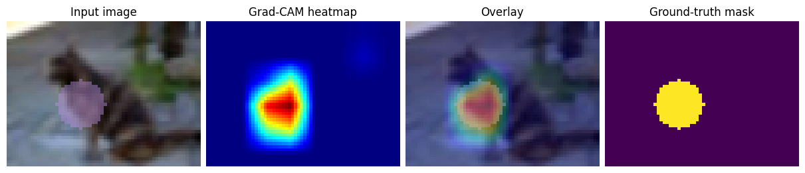
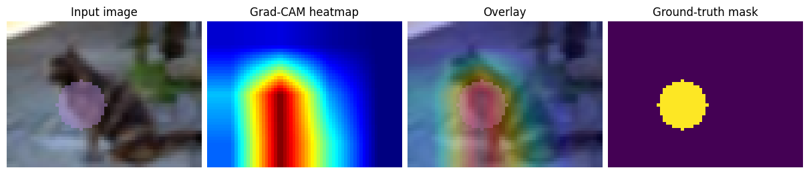

# Wojciech Mierzejek 459435 DNN Homework 2

## Exemplary visualization of the output of the Grad-Cam

#### Grad-CAM last layer


#### Grad-CAM middle layer



## SAM Pipeline 1
In the first pipeline I decided to try out providing only one foreground point to the SAM. The point is chosen by calculating average coordinate of 20 points from GradCAM heatmap with highest value.

## SAM Pipeline 2
The second pipeline I also base on GradCAM. 5 points from GradCAM with highest value are provided as foreground and 5 points with lowest values are considered background.

## Metrics
```
Pipeline 1 (foreground only):
	Hitrate foreground only: 80.2000%
	Hitrate foreground and background: 80.2000%
	Average distance: 4.9514
	Average intersection over union: 83.8739%
Pipeline 2 (foreground and background):
	Hitrate foreground only: 70.3600%
	Hitrate foreground and background: 85.1200%
	Average distance: 2.7969
	Average intersection over union: 73.0895%
```

## Discussion
I was surprised with how well the first pipeline performed. I think finding center of mass of GradCAM mask might be improved, perhaps by calculating average of all points above some threshold. 